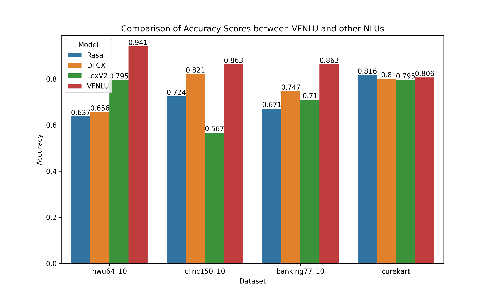

# VFNLU Tests
This repo contains starter code and benchmarks for evaluating VFNLU. 

## Benchmarks
Found in the `src/benchmarks` folder, the benchmarks are the popular intent classification benchmarks of HWU64, Banking77, CLINC150 and CureKart. The first three are the 10-shot variants.

## Regression Testing
Starter code to run regression tests with the VFNLU found under `src/regression_testing`.