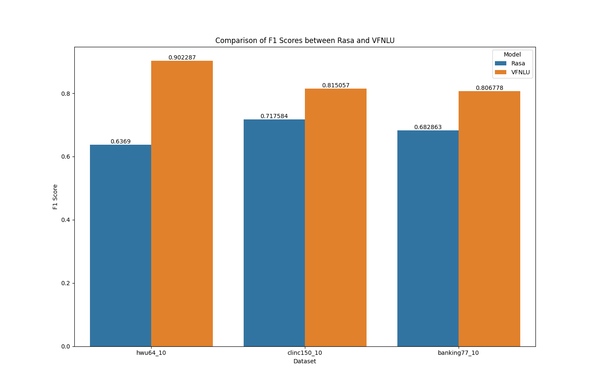

# VFNLU Benchmarks

This library contains a set of benchmarks for evaluating the performance of the Voiceflow, VFNLU model on intent classification. A comparison point is also provided compared to baseline Rasa NLU model.
The benchmarks chose are the popular HWU64, Banking77, CLINC150, all focused on 10-shot learning.

## Installation guide
`pip install -r requirements.txt`

## Testing the VFNLU
1. Create a free Voiceflow account.
2. Upload the three benchmarks vf_files (.vf)*
3. After uploading the files, head to the integrations tag on the left side of the screen and copy the DM key.
4. Paste the DM key in a .env file under the corresponding project key name.
5. Train the model either through the VFNLU or calling the train NLU function in run_voiceflow_benchmark.py
6. Run the evaluation by running compare_benchmarks.py

*the free version of Voiceflow only allows 2 projects at a time, so you will have to delete one of the benchmarks to upload the next one.

## Extending the benchmarks
To extend the benchmarks, you can do the following steps:
1. Add addition benchmarks to VFNLU/data folder. They should have a seq.in file and a label file and have a test and train sub folder.
2. Run the rasa converter under nlu_rasa.py
3. Run the VF file created under create_voiceflow_project.py
4. Open a pull request with the new datafiles and the new VF files.

## Results
VFNLU outperforms rasa on the three benchmarks included.

### Impact of the None intent
The None intent in practice helps avoid false positives for unrelated domains. Due to the introduction of this new intent, it reduces the accuracy in benchmarks since there are supposed to be no false positives.
Typically None intents are used by low confidence matching, but when using softmax the results can still be skewed. For example asking if a cat is a fruit or vegetable doesn't make sense without a None response.
In production, the VFNLU always has None as the larges intent, impacting true positive rate of some requests.

### Comparison against other VFNLU published benchmarks
The additional difference from the two results, apart from the None intent can be attributed to variations in hyperparameters such as batch size and learning rate.
Below the values are listed for accuracy results.

| Dataset                 | HWU64  | CLINC150 | Banking77 |
|-------------------------|--------|----------|-----------|
| VFNLU Benchmark         | 94.1%  | 86.3%    | 86.3%     |
| VFNLU Prod              | 90.5%  | 81.5%    | 81.3%     |
| None intent %           | 2.8%   | 2.5%     | 0.7%      |
| Unexplained Variance    | 0.8%   | 2.3%     | 4.3%      |
