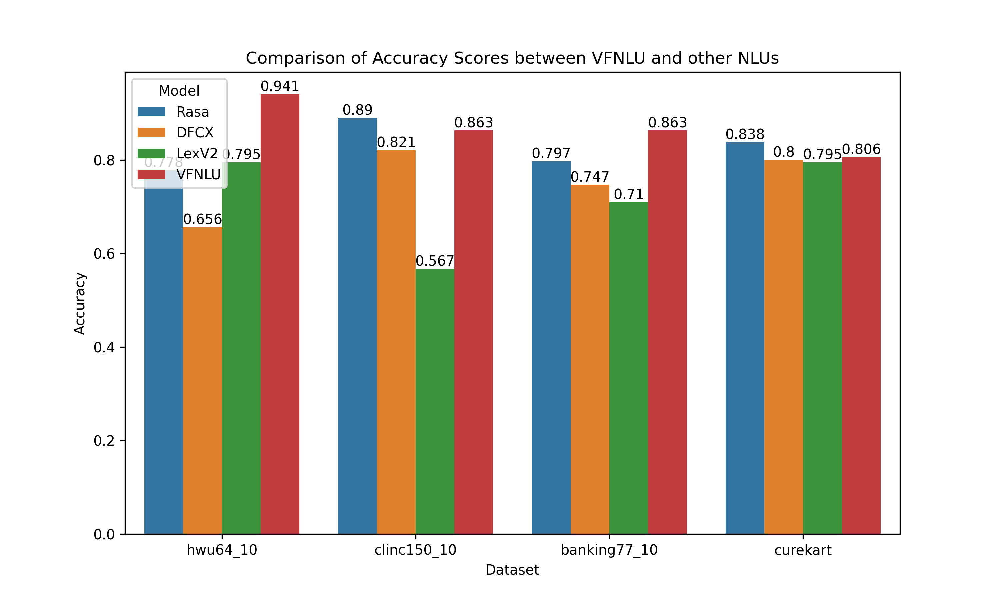

# VFNLU Benchmarks

This library contains a set of benchmarks for evaluating the performance of the Voiceflow, VFNLU model on intent classification. A comparison point is also provided compared to baseline Rasa NLU model.
The benchmarks chose are the popular intent classification benchmarks of HWU64, Banking77, CLINC150 and CureKart. The first three are the 10-shot variants.

## Installation guide
`pip install -r requirements.txt`

## Testing the VFNLU
1. Create a free Voiceflow account.
2. Upload the four benchmarks vf_files (.vf)*
3. After uploading the files, head to the integrations tag on the left side of the screen and copy the DM key.
4. Paste the DM key in a .env file under the corresponding project key name.
5. Train the model either through the VFNLU or calling the train NLU function in `run_voiceflow_benchmark.py`
6. Run the evaluation by running `compare_benchmarks.py` and change `local_result_load` to `False` to avoid cached results

*the free version of Voiceflow only allows 2 projects at a time, so you will have to delete a benchmark to upload the next one.

## Extending the benchmarks
To extend the benchmarks, you can do the following steps:
1. Add addition benchmarks to VFNLU/data folder. They should have a seq.in file and a label file and have a test and train sub folder.
2. Run the Rasa, DF CX or Lex converters under each respective folder.
3. Run the VF file created under `helpers/create_voiceflow_project.py`
4. Open a pull request with the new datafiles and the new VF files.

## Results
VFNLU outperforms DialogFlow CX, Lex v2 and Rasa DIET  on the four benchmarks included. It splits two benchmarks with Rasa on LMF (contrastive learning)

## NLU vs LLMs
LLMs have shown strong performance on a variety of tasks but are still not efficient for intent recognition for large applications.

VFNLU outperforms ChatGPT-3.5 and GPT-4 on the Banking77 benchmark while costing 100s of times less. Other benchmarks were not run given the cost and throughput limitations.

## Impact of the None intent
The None intent in practice helps avoid false positives for unrelated domains. Due to the introduction of this new intent, it reduces the accuracy in benchmarks since they assume no unrelated utterances.
The VFNLU is quite senstive to the introduction of this new intent, so it is important to understand its impact.
When deployed as a hosted option, the VFNLU always has None as its largest intent, impacting true positive rate of some requests.

### Comparison against other VFNLU published benchmarks
The additional difference from the two results, apart from the None intent can be attributed to variations in hyperparameters such as batch size and learning rate.
Below is a comparison between both sets of benchmarks for % accuracy.

| Dataset              | HWU64 | CLINC150 | Banking77 | CureKart |
|----------------------|-------|----------|-----------|----------|
| VFNLU Benchmark      | 94.1% | 86.3%    | 86.3%     | 80.6%    |
| VFNLU Prod           | 90.5% | 81.5%    | 81.3%     | 71.4%    |
| Difference           | 3.6%  | 4.8%     | 5.0%      | 9.2%     |
| None intent %        | 2.8%  | 2.5%     | 0.7%      | 19.9%    |
| Unexplained Variance | 0.8%  | 2.3%     | 4.3%      | -10.5%   |

### Comparison Rasa DIET with None intent
Rasa shows minimal changes in accuracy between the base dataset and one with explicit None examples. Rasa in one case performs better with a None intent which is quite strange.

| Dataset              | HWU64 | CLINC150 | Banking77 | CureKart |
|----------------------|-------|----------|-----------|----------|
| Rasa Base            | 63.7% | 72.4%    | 67.1%     | 81.6%    |
| Rasa None            | 62.4% | 72.2%    | 69.8%     | 79.8%    |
| Difference           | 1.3%  | 0.2%     | -2.7%     | 1.8%     |
| None intent %        | 1.6%  | 0.4%     | 0.4%      | 3.9%     |
| Unexplained Variance | -0.3% | -0.2%    | - 3.1%    | -2.1%    |

### Comparison Rasa LMF with None intent
Rasa LMF is a transformer based model using contrastive learning and a t5 encoder model. It performs better than the original Rasa DIET model and has smaller final models with a logistic regression head.
However the pipeline is still monolingual and does not support entities out of the box.

| Dataset              | HWU64 | CLINC150 | Banking77 | CureKart |
|----------------------|-------|----------|-----------|----------|
| Rasa Base            | 77.8% | 89.0%    | 79.7%     | 83.8%    |
| Rasa None            | 76.4% | 88.6%    | 79.6%     | 78.9%    |
| Difference           | 1.4%  | 0.4%     | -0.1%     | 3.9%     |
| None intent %        | 3.1%  | 0.8%     | 0.3%      | 6.8%     |
| Unexplained Variance | -1.7% | -0.4%    | -0.2%     | -2.9%    |

### Comparison DFCX with Enriched Default Negative Intent 
Dialogflow CX is quite sensitive when enriching their built in None Intent (called Default Negative Intent). For DFCX many of the mismatches seem to be redirected to the None intent which is an interesting pattern.

| Dataset              | HWU64  | CLINC150 | Banking77 | CureKart |
|----------------------|--------|----------|-----------|----------|
| DFCX Base            | 65.6%  | 82.1%    | 74.7%     | 80.0%    |
| DFCX None            | 41.4%  | 78.2%    | 73.9%     | 77.8%    |
| Difference           | 24.2%  | 3.9%     | 0.8%      | 2.2%     |
| None intent %        | 40.3%  | 16.9%    | 8.6%      | 8.9%     |
| Unexplained Variance | -16.1% | -13.0%   | -7.8%     | -6.7%    |